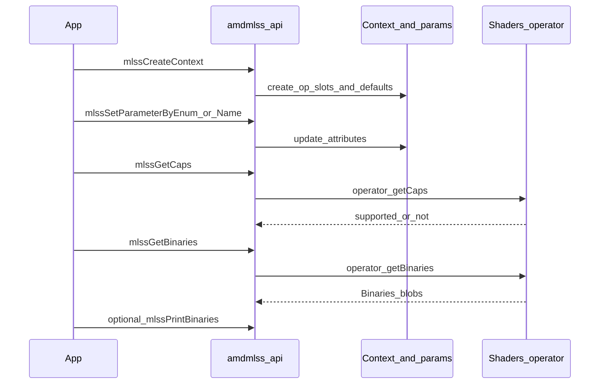
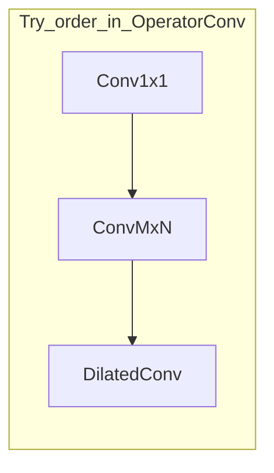
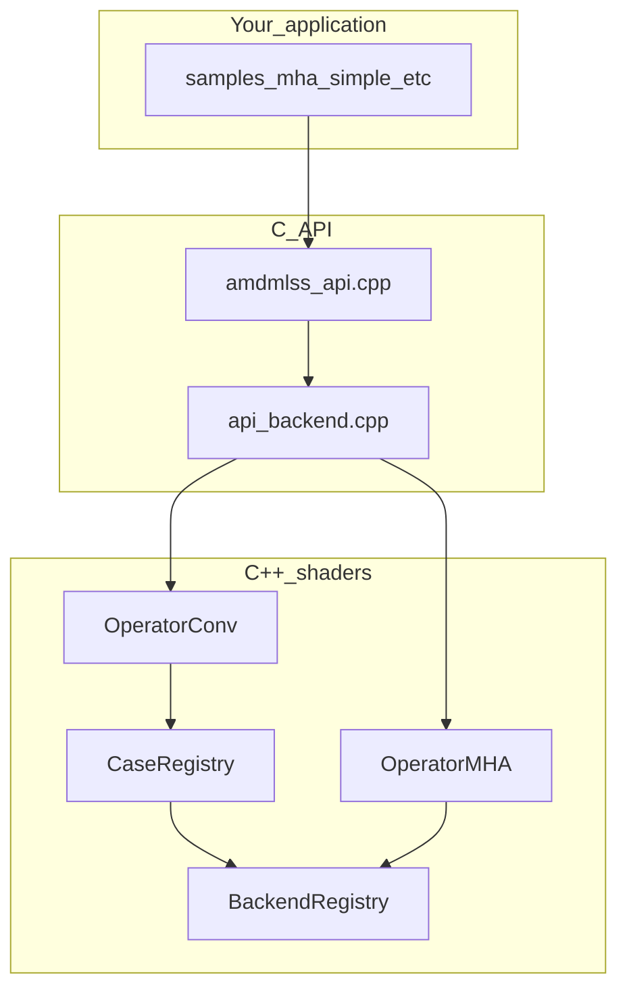
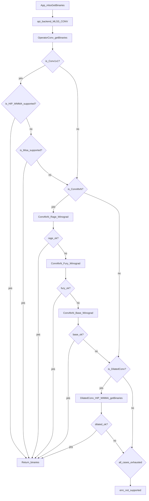
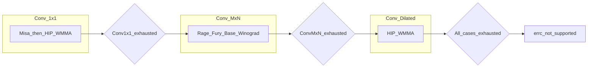
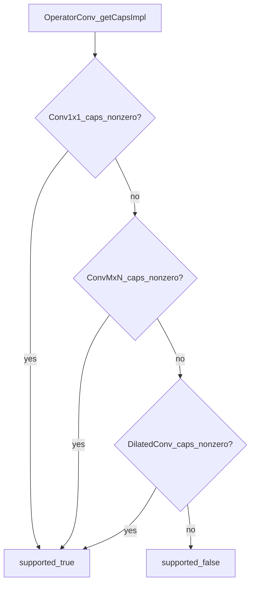
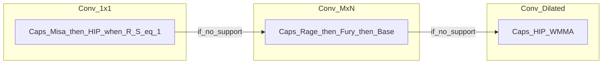

### AMDMLSS, AMD Machine Learning Software Stack

## Welcome

This document is written for **new hires** who need a fast mental model of AMDMLSS: what the library does, how the **C API** is used, which **shader paths** exist today, and where to change code when adding operators or variants.

**In one sentence:** AMDMLSS builds **GPU shader binaries** (code objects) for a given **ASIC** and **operation** (MHA, GQA, Conv, …) from parameters you set on a **context**.

---

## Overview

This project aims to isolate the metacmd kernels and the fetch logic from DXCP.

## Design document

The design document is still evolving. It lives in the `notes` directory.

---

## Glossary

| Term          | Meaning                                                                                                                                                                            |
| ------------- | ---------------------------------------------------------------------------------------------------------------------------------------------------------------------------------- |
| **ASIC**      | Target GPU architecture, expressed as a string macro such as `MLSS_GFX1100` or `MLSS_GFXAUTOFIND` (see [amdmlss_api_cdefs.h](modules/common/include/amdmlss/amdmlss_api_cdefs.h)). |
| **Context**   | Library handle holding one or more **operations** and their parameters for one ASIC. Created with `mlssCreateContext` / `mlssCreateContextList`.                                   |
| **Operation** | A logical op name such as `MLSS_MHA` or `MLSS_CONV` (each expands to a string like `"MLSS_MHA"`).                                                                                  |
| **Caps**      | Capability query: whether the current parameters are supported on the chosen ASIC (`mlssGetCaps`).                                                                                 |
| **Binaries**  | Compiled shader payloads returned by `mlssGetBinaries` (rel/non-rel variants, metadata).                                                                                           |
| **Case**      | One algorithm family inside an operator (e.g. Conv1x1 vs ConvMxN). Registered via `CaseBase` / `CaseRegistry`.                                                                     |
| **Backend**   | One concrete implementation inside a case or operator (e.g. CK MHA, HIP WMMA conv). Registered via `BackendBase` / `BackendRegistry`; selection may use `BackendSelector`.         |

---

## Where to look first

| If you want to…                      | Open                                                                                                                                                                        |
| ------------------------------------ | --------------------------------------------------------------------------------------------------------------------------------------------------------------------------- |
| See every public C function          | [modules/c_api/include/amdmlss/amdmlss_api.h](modules/c_api/include/amdmlss/amdmlss_api.h)                                                                                  |
| Find op names and attribute enums    | [modules/common/include/amdmlss/amdmlss_api_cdefs.h](modules/common/include/amdmlss/amdmlss_api_cdefs.h)                                                                    |
| See how C calls reach C++ operators  | [modules/c_api/src/api_backend.cpp](modules/c_api/src/api_backend.cpp)                                                                                                      |
| See default parameters per op        | `createAttributes` in [modules/core/src/parameters.cpp](modules/core/src/parameters.cpp)                                                                                    |
| See shader selection code            | [modules/shaders/src/operators/](modules/shaders/src/operators/)                                                                                                            |
| Understand case vs backend templates | [modules/core/include/core/impl/operators/case.hxx](modules/core/include/core/impl/operators/case.hxx), [backend.hxx](modules/core/include/core/impl/operators/backend.hxx) |

---

## Sample programs (start here)

All samples are single `.c` files under [samples/](samples/). CMake builds each as its own executable (see [samples/CMakeLists.txt](samples/CMakeLists.txt)).

| Sample                                                           | What it demonstrates                                                                                                                                                                                                                                                                              |
| ---------------------------------------------------------------- | ------------------------------------------------------------------------------------------------------------------------------------------------------------------------------------------------------------------------------------------------------------------------------------------------- |
| [samples/mha_simple_example.c](samples/mha_simple_example.c)     | **End-to-end MHA flow:** `mlssCreateContext` → `mlssSetParameterByEnum` / `mlssSetParameterByName` (strides) → `mlssPrintParameters` → `mlssGetCaps` → `mlssGetBinaries` → `mlssPrintBinaries`. Also **CLI**: `--verbose`, `--gfx` (normalizes user input to `MLSS_GFX…`), `CHECK_STATUS` helper. |
| [samples/gqa_simple_example.c](samples/gqa_simple_example.c)     | Same pattern as MHA for **GQA** (`MLSS_GQA`, GQA attribute enums).                                                                                                                                                                                                                                |
| [samples/mha_verbose_example.c](samples/mha_verbose_example.c)   | MHA with **verbosity** set before work (`mlssSetVerboseLevel`).                                                                                                                                                                                                                                   |
| [samples/custom_type_example.c](samples/custom_type_example.c)   | `**mlssRegisterCustomType`**: pack many fields into one struct, then `mlssSetParameterByNameTyped` to apply it to an op. Shows how enums map to `mlssSetParameterByEnum` inside the setter.                                                                                                       |
| [samples/test_device_features.c](samples/test_device_features.c) | `**mlssGetDeviceFeatures**` and `**mlssGetOptimalDeviceFeatures**` for listing GPUs.                                                                                                                                                                                                              |

Tip: read `mha_simple_example.c` top to bottom once; it is the reference narrative for the rest of this README.

---

## C API at a glance

### Typical call order

Concrete line references (MHA):

1. **Create context** — `mlssCreateContext(&context, asic, MLSS_MHA)` in [mha_simple_example.c](samples/mha_simple_example.c) (see “Step 1”).
2. **Set parameters** — Prefer enums: `mlssSetParameterByEnum` with `MLSS_ATTR_MHA_`* (Step 2). Strides use `mlssSetParameterByName` in the sample.
3. **Debug layout** — `mlssPrintParameters(context, opName)` (same file).
4. **Caps** — `mlssGetCaps(context, &pStatuses, &nStatuses)`.
5. **Binaries** — `mlssGetBinaries(context, &binaries, &n)` then `mlssPrintBinaries(binaries, n)`.

### API groups (reference)

| Group        | Functions                                                                                                                                   |
| ------------ | ------------------------------------------------------------------------------------------------------------------------------------------- |
| Context      | `mlssCreateContext`, `mlssCreateContextList` (end list with `MLSS_END_LIST`)                                                                |
| Parameters   | `mlssSetParameterByName`, `mlssSetParameterByEnum`, `mlssSetParameterByNameTyped`                                                           |
| Query        | `mlssGetCaps`, `mlssGetBinaries`                                                                                                            |
| Errors       | `mlssPeakAtLastError`, `mlssGetLastError`, `mlssGetErrorString`                                                                             |
| Version      | `mlssGetVersion`, `mlssGetVersionAsString`                                                                                                  |
| Diagnostics  | `mlssSetVerboseLevel`, `mlssGetVerboseLevel`, `mlssEnableVerboseMode`, `mlssDisableVerboseMode`, `mlssPrintParameters`, `mlssPrintBinaries` |
| Device       | `mlssGetDeviceFeatures`, `mlssGetOptimalDeviceFeatures`                                                                                     |
| Custom types | `mlssRegisterCustomType`, `mlssGetCustomTypeInfo`, `mlssUnregisterCustomType`, `mlssIsCustomType`                                           |

**Headers:** public declarations live in [amdmlss_api.h](modules/c_api/include/amdmlss/amdmlss_api.h); macros and types in [amdmlss_api_cdefs.h](modules/common/include/amdmlss/amdmlss_api_cdefs.h).

**Memory ownership:** anything returned from the API (handles, arrays of binaries, caps arrays, device lists) follows the contract in the **Doxygen comments** on each function in `amdmlss_api.h`. When in doubt, read the comment for that specific function before freeing pointers.

**Important implementation detail:** the C layer does **not** use a runtime registry to find operators. It matches `op.m_op` strings explicitly in [api_backend.cpp](modules/c_api/src/api_backend.cpp) for both caps and binaries.

| API                      | Status                                                                                                                                                              |
| ------------------------ | ------------------------------------------------------------------------------------------------------------------------------------------------------------------- |
| `mlssEnumerateOperators` | Stub: returns `MLSS_WARNING_NOT_IMPLEMENTED` ([amdmlss_api.cpp](modules/c_api/src/amdmlss_api.cpp)). You cannot discover ops at runtime through this call yet.      |
| ASIC to internal arch    | Only some `MLSS_GFX…` strings are mapped to `GfxIpTriple` in `api_backend.cpp`. If your ASIC is ignored, extend the same mapping in **both** caps and binary paths. |

---

## Supported shader implementations

### Operations vs C API wiring

| C macro (op string)                        | Used in C API (`api_backend.cpp`) | What runs in shaders today                                                                                                   |
| ------------------------------------------ | --------------------------------- | ---------------------------------------------------------------------------------------------------------------------------- |
| `MLSS_MHA`                                 | Yes                               | CK MHA: [impl/mha/ck/](modules/shaders/src/operators/impl/mha/ck/)                                                           |
| `MLSS_GQA`                                 | Yes                               | CK GQA: [impl/gqa/ck/](modules/shaders/src/operators/impl/gqa/ck/)                                                           |
| `MLSS_CONV`                                | Yes                               | Conv cases (table below) via [conv.cpp](modules/shaders/src/operators/conv.cpp)                                              |
| `MLSS_GEMM`                                | Yes                               | Scaffold only ([gemm.cpp](modules/shaders/src/operators/gemm.cpp))                                                           |
| `MLSS_MVN`                                 | Yes                               | Scaffold only ([mvn.cpp](modules/shaders/src/operators/mvn.cpp))                                                             |
| `MLSS_QGEMM`                               | Yes                               | Scaffold only ([qgemm.cpp](modules/shaders/src/operators/qgemm.cpp))                                                         |
| `MLSS_CONV_DILATED`, `MLSS_CONV_DEPTHWISE` | No                                | Attribute tables exist in [parameters.cpp](modules/core/src/parameters.cpp); **no** matching branch in `api_backend.cpp` yet |

**Scaffold** means: parameters and operator shells exist, but `getBinaries` does not return real code objects yet.

### Convolution only (`MLSS_CONV`)

One C operation name; **inside** the library several **cases** are tried in order until one succeeds:

| Case        | Folder                                                                 | Backends tried (simplified)                                                                                                                                                                  |
| ----------- | ---------------------------------------------------------------------- | -------------------------------------------------------------------------------------------------------------------------------------------------------------------------------------------- |
| Conv1x1     | [impl/conv/1x1/](modules/shaders/src/operators/impl/conv/1x1/)         | Misa, then HIP WMMA ([conv1x1.cpp](modules/shaders/src/operators/impl/conv/1x1/conv1x1.cpp))                                                                                                 |
| ConvMxN     | [impl/conv/mxn/](modules/shaders/src/operators/impl/conv/mxn/)         | Winograd **Rage** → **Fury** → **Base** ([convMxN.cpp](modules/shaders/src/operators/impl/conv/mxn/convMxN.cpp)). Misa code exists under `mxn/Misa/` but is **not** in that try order today. |
| DilatedConv | [impl/conv/dilated/](modules/shaders/src/operators/impl/conv/dilated/) | HIP WMMA ([dilatedConv.cpp](modules/shaders/src/operators/impl/conv/dilated/dilatedConv.cpp))                                                                                                |

**Depth-wise:** `DepthWiseConv` is registered as a case in [conv.cpp](modules/shaders/src/operators/conv.cpp) but **not** invoked from `OperatorConv::getBinaries` / `getCapsImpl` yet; treat as WIP ([depthWiseConv.cpp](modules/shaders/src/operators/impl/conv/depthWise/depthWiseConv.cpp)).

---

## Architecture: how pieces connect

High-level map from your app to shader code:

### Example scene: convolution (`MLSS_CONV`)

There is **no** dedicated convolution sample in [samples/](samples/) yet; mentally reuse the **same API sequence** as [samples/mha_simple_example.c](samples/mha_simple_example.c): create context, set parameters, optional `mlssPrintParameters`, `mlssGetCaps`, `mlssGetBinaries` — only swap `MLSS_MHA` for `**MLSS_CONV`** and set the `**MLSS_ATTR_CONV_***` fields (names and enums are in [amdmlss_api_cdefs.h](modules/common/include/amdmlss/amdmlss_api_cdefs.h); defaults are built in `createAttributes` for `MLSS_CONV` in [parameters.cpp](modules/core/src/parameters.cpp)).

| Stage         | What runs for convolution                                                                                                                                                                                                                                |
| ------------- | -------------------------------------------------------------------------------------------------------------------------------------------------------------------------------------------------------------------------------------------------------- |
| C API         | [api_backend.cpp](modules/c_api/src/api_backend.cpp) sees `op.m_op == "MLSS_CONV"` and constructs `OperatorConv`, copies your context attributes, sets `GfxIpTriple`, then calls `**getCaps**` / `**getBinaries**` on that object (same pattern as MHA). |
| Operator      | [OperatorConv](modules/shaders/include/shaders/operators/conv.hpp) in [conv.cpp](modules/shaders/src/operators/conv.cpp) **walks cases in order** until one produces binaries (or reports support for caps).                                             |
| Case: 1×1     | [Conv1x1](modules/shaders/src/operators/impl/conv/1x1/conv1x1.cpp) tries backends **Misa** then **HIP WMMA** (`BackendRegistry<Conv1x1>`).                                                                                                               |
| Case: M×N     | [ConvMxN](modules/shaders/src/operators/impl/conv/mxn/convMxN.cpp) tries **Winograd Rage → Fury → Base** (`BackendRegistry<ConvMxN>`).                                                                                                                   |
| Case: dilated | [DilatedConv](modules/shaders/src/operators/impl/conv/dilated/dilatedConv.cpp) uses **HIP WMMA** (`BackendRegistry<DilatedConv>`).                                                                                                                       |

**Two decision layers:** (1) **Case** — `OperatorConv` asks **Conv1x1**, then **ConvMxN**, then **DilatedConv**; the next case runs only if the previous case did not return binaries (`getBinaries` in [conv.cpp](modules/shaders/src/operators/conv.cpp)). (2) **Backend** — inside each case, `getBinaries` walks a **fixed backend list**; the next backend runs only if the previous one did not return a value (`std::expected` has no value). **Caps** (`getCapsImpl` in the same file) reuse the **same case order** and, inside each case, similar backend ordering, but any **non-zero** caps score from any tried path can mark the op as capable at the top level.

Two diagrams per topic below: **(1) Linear** — same order as the code, top to bottom, easiest to read. **(2) Structural** — the three **cases** at one level so you see where you are (1×1 vs M×N vs dilated) and where **case gates** sit between cases and after the last case.

**Time order is always 1 → 2 → 3**; the structural view does not mean parallel execution.

`mlssGetBinaries` — **linear** (first diamonds **route by case**; inner diamonds are **backend** `getBinaries` / support checks. The implementation still always invokes the three cases in order in [conv.cpp](modules/shaders/src/operators/conv.cpp); this layout matches how you **read** the decision tree.)

The first diamonds are a **reading guide** (“does this look like a 1×1 / M×N / dilated problem?”). In [conv.cpp](modules/shaders/src/operators/conv.cpp), `**OperatorConv::getBinaries` still calls the three cases in a fixed order**; the HIP / Misa / Winograd / dilated HIP nodes are the actual `getBinaries` attempts. On the **yes** branch of `is_Conv1x1?`, the diagram follows your order (**HIP** then **Misa**); the source tries **Misa first, then HIP**—swap the two diamonds mentally when stepping through [conv1x1.cpp](modules/shaders/src/operators/impl/conv/1x1/conv1x1.cpp).

`mlssGetBinaries` — **structural** (three blocks at one level; inner labels summarize **backend** order; arrows are the **case gates** from the linear diagram):

`mlssGetCaps` / `OperatorConv::getCapsImpl` — **linear** (short-circuit OR: first non-zero wins):

`mlssGetCaps` — **structural** (same three cases; **left to right** matches `getCapsImpl` short-circuit order):

Inside **Conv1x1** caps when `R,S == 1`, backends are consulted **Misa first, else HIP** ([conv1x1.cpp](modules/shaders/src/operators/impl/conv/1x1/conv1x1.cpp)). Inside **ConvMxN** caps, backends are tried **Rage, then Fury, then Base** until one yields a non-zero score ([convMxN.cpp](modules/shaders/src/operators/impl/conv/mxn/convMxN.cpp)). **DilatedConv** caps use the HIP entry when registered ([dilatedConv.cpp](modules/shaders/src/operators/impl/conv/dilated/dilatedConv.cpp)).

**Contrast with MHA/GQA:** those operators use `**BackendSelector`** at the operator level: every registered backend gets a caps score and the **highest score wins**. The three **live** Conv cases (Conv1x1, ConvMxN, DilatedConv) instead use **hand-written backend order** in the `.cpp` files above, so the diagrams are the literal control flow. However, `BackendSelector` is not exclusive to operator-level selection — individual **Conv cases** can use it too. `DepthWiseConv` (WIP, not on the live dispatch path yet) already delegates to `BackendSelector<DepthWiseConv>::select` in its `getBinaries` ([depthWiseConv.cpp](modules/shaders/src/operators/impl/conv/depthWise/depthWiseConv.cpp)), establishing the pattern for future cases that prefer score-based selection over a fixed try order.

| Concept   | Template / type                                                               | Role                                                                                                                                  |
| --------- | ----------------------------------------------------------------------------- | ------------------------------------------------------------------------------------------------------------------------------------- |
| Case      | `CaseBase<Derived, OperatorType>`                                             | Registers one **algorithm family** in `CaseRegistry<OperatorType>` (Conv).                                                            |
| Backend   | `BackendBase<Derived, ParentType>`                                            | Registers one **implementation** in `BackendRegistry<ParentType>`.                                                                    |
| Auto pick | `BackendSelector<OperatorMHA>` (etc.), `BackendSelector<DepthWiseConv>` (WIP) | Picks backend with best **caps score** among registered backends. Used at operator level (MHA, GQA) or at case level (DepthWiseConv). |

**Registration trick:** static members run `registerCase` / `registerBackend` at startup. You still add `**template class mlss::CaseBase<…>`** or `**template class mlss::BackendBase<…>**` in a `.cpp` so the linker instantiates that registration (examples: [conv.cpp](modules/shaders/src/operators/conv.cpp), [mha.cpp](modules/shaders/src/operators/mha.cpp), [convMxN.cpp](modules/shaders/src/operators/impl/conv/mxn/convMxN.cpp)).

**Build:** new `.cpp` files under [modules/shaders/src/](modules/shaders/src/) are picked up automatically (`GLOB_RECURSE` via [modules/shaders/CMakeLists.txt](modules/shaders/CMakeLists.txt) and [cmake/utils.cmake](cmake/utils.cmake)). Optional `.cppm` shader modules are added when present.

---

## How to add a new shader variant

“Variant” = new **backend** or new **case**.

| Step | Action                                                                                                                                                                                                                                                                                                                                                     |
| ---- | ---------------------------------------------------------------------------------------------------------------------------------------------------------------------------------------------------------------------------------------------------------------------------------------------------------------------------------------------------------- |
| 1    | **Choose parent:** operator-level backend (e.g. second MHA path), new **Conv case**, or new backend under `Conv1x1` / `ConvMxN` / `DilatedConv`.                                                                                                                                                                                                           |
| 2    | **Implement:** backends use `getOperatorName()`; cases use `getCaseName()`. Implement `getCapsImpl` (non-zero score when supported) and `getBinaries()` returning `Binaries` (see [shaders.hpp](modules/shaders/include/shaders/shaders.hpp) helpers).                                                                                                     |
| 3    | **Register:** add `template class mlss::BackendBase<…>` or `CaseBase<…>` in a linked `.cpp`.                                                                                                                                                                                                                                                               |
| 4    | **Wire selection:** if parent uses `BackendSelector`, your backend is picked by score. If parent uses **manual** `BackendRegistry::get<Concrete>()`, edit try order in that parent’s `getBinaries` / `getCapsImpl`. For a **new Conv case**, extend [conv.cpp](modules/shaders/src/operators/conv.cpp) with `CaseRegistry<OperatorConv>::get<YourCase>()`. |

---

## How to add a new operator

| Step | Where                                                                                                                                       | Why                                                                                                                                                                         |
| ---- | ------------------------------------------------------------------------------------------------------------------------------------------- | --------------------------------------------------------------------------------------------------------------------------------------------------------------------------- |
| 1    | [amdmlss_api_cdefs.h](modules/common/include/amdmlss/amdmlss_api_cdefs.h)                                                                   | Add `MLSS_YOUROP` style macro so C code passes the same string the backend expects.                                                                                         |
| 2    | [parameters.cpp](modules/core/src/parameters.cpp) `createAttributes`                                                                        | Default attribute vector for `Context::Op::create` ([context.cpp](modules/core/src/impl/types/context.cpp)).                                                                |
| 3    | [modules/shaders/include/shaders/operators/](modules/shaders/include/shaders/operators/) + [src/operators/](modules/shaders/src/operators/) | New `OperatorBase<Derived>` type; add cases/backends if needed ([mha.hpp](modules/shaders/include/shaders/operators/mha.hpp) pattern).                                      |
| 4    | [api_backend.cpp](modules/c_api/src/api_backend.cpp)                                                                                        | `#include` your operator header; add `**else if (op.m_op == …)`** in **both** caps and binary loops (same style as `MLSS_MHA`). Missing either branch = unreachable from C. |
| 5    | Same file                                                                                                                                   | Extend ASIC → `GfxIpTriple` mapping if your op cares about architecture.                                                                                                    |
| 6    | [samples/](samples/) (recommended)                                                                                                          | Copy `mha_simple_example.c`, rename steps, swap op macro and attribute enums so the next hire has a runnable recipe.                                                        |

---

## Related source locations

| Topic                                                | Location                                                                                                                           |
| ---------------------------------------------------- | ---------------------------------------------------------------------------------------------------------------------------------- |
| C++ operator registry (not driving C dispatch today) | [base.hxx](modules/core/include/core/impl/operators/base.hxx), [operators.cpp](modules/core/src/impl/operators.cpp)                |
| Case / backend definitions                           | [case.hxx](modules/core/include/core/impl/operators/case.hxx), [backend.hxx](modules/core/include/core/impl/operators/backend.hxx) |
| C wrappers                                           | [amdmlss_api.cpp](modules/c_api/src/amdmlss_api.cpp)                                                                               |

