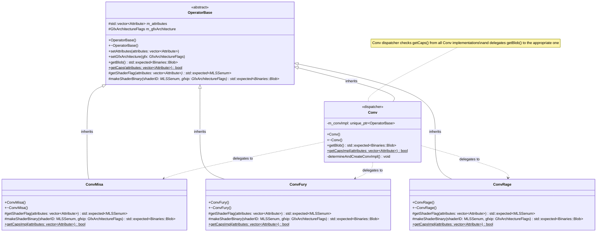

<!-- Copyright (c) 2026 Advanced Micro Devices, Inc. All rights reserved. -->

# AMDMLSS Operator Class Hierarchy

## UML Class Diagram



## Legend
- `+` Public method
- `#` Protected method
- `-` Private method
- `$` Static method
- `*` Pure virtual method (abstract)
- `<<abstract>>` Abstract class
- `<<dispatcher>>` Dispatcher/Facade class
- `-->` Inheritance relationship
- `..>` Delegation/Uses relationship

## Key Design Features

### OperatorBase (Abstract Base Class)
- **Purpose**: Provides common interface and implementation for all operator types
- **Key Members**:
  - `m_attributes`: Stores operator parameters/attributes
  - `m_gfxArchitecture`: Target GPU architecture
- **Virtual Methods**:
  - `getShaderFlag()`: Pure virtual - each derived class must implement to select appropriate shader
  - `makeShaderBinary()`: Pure virtual - each derived class must implement to create shader binary
- **Public Interface**:
  - `getBlob()`: Template method that calls getShaderFlag() and makeShaderBinary()
  - `getCaps()`: Static method to validate if parameters are supported

### Derived Classes (ConvMisa, ConvFury, ConvRage)
Each convolution implementation:
1. **Implements `getShaderFlag()`**: 
   - Analyzes attributes to determine which shader variant to use
   - Returns appropriate shader enum flag
   
2. **Implements `makeShaderBinary()`**:
   - Creates the actual shader binary for the selected shader
   - Handles architecture-specific shader selection
   
3. **Implements static `getCaps()`**:
   - Validates if given parameters are supported
   - Returns true/false for capability check

## Usage Flow

```
1. Create operator instance (e.g., ConvMisa)
2. Call setAttributes() to configure parameters
3. Call setGfxArchitecture() to set target GPU
4. Call getBlob() which:
   a. Calls getShaderFlag() to select shader
   b. Calls makeShaderBinary() to create binary
   c. Returns Binaries::Blob with shader data
5. Static getCaps() can be called independently to validate parameters
```

## Benefits of this Design
- **Polymorphism**: Common interface allows treating all operators uniformly
- **Template Method Pattern**: getBlob() defines algorithm structure, derived classes fill in details
- **Separation of Concerns**: Each convolution type encapsulates its specific shader selection logic
- **Extensibility**: Easy to add new operator types by inheriting from OperatorBase

## ASCII Art Version

```
                              +----------------------------------+
                              |        <<abstract>>              |
                              |         OperatorBase             |
                              +----------------------------------+
                              | # m_attributes: vector<Attribute>|
                              | # m_gfxArchitecture: GfxArchFlags|
                              +----------------------------------+
                              | + OperatorBase()                 |
                              | + ~OperatorBase()                |
                              | + setAttributes(...)             |
                              | + setGfxArchitecture(...)        |
                              | + getBlob(): expected<Blob>      |
                              | + getCaps(...): bool [static]    |
                              | + getCapsImpl(...): bool [static]|
                              | # getShaderFlag(...) [pure virt] |
                              | # makeShaderBinary(...) [pure v] |
                              +----------------------------------+
                                               △
                                               |
            +------------------+---------------+------------------------+------------------------+
            |                  |               |                        |                        |
            |                  |               |                        |                        |
   +------------------+  +------------+  +------------------------+  +------------------------+  +------------------------+
   |               |  |            |  |       ConvMisa         |  |       ConvFury         |  |       ConvRage         |
   |      Conv        |  |            |  +------------------------+  +------------------------+  +------------------------+
   +------------------+  |            |  | + ConvMisa()           |  | + ConvFury()           |  | + ConvRage()           |
   |- m_convImpl      |  |            |  | + ~ConvMisa()          |  | + ~ConvFury()          |  | + ~ConvRage()          |
   +------------------+  |            |  | # getShaderFlag(...)   |  | # getShaderFlag(...)   |  | # getShaderFlag(...)   |
   |+ Conv()          |  |            |  | # makeShaderBinary(...)|  | # makeShaderBinary(...)|  | # makeShaderBinary(...)|
   |+ ~Conv()         |  |            |  | + getCapsImpl [static] |  | + getCapsImpl [static] |  | + getCapsImpl [static] |
   |+ getBlob()       |  |            |  +------------------------+  +------------------------+  +------------------------+
   |+ getCapsImpl()   |  |            |                |                        |                        |
   +------------------+  +------------+                 |                        |                        |
            |                                           |                        |                        |
            +- - - - - - - delegates to - - - - - - - ->+------------------------+------------------------+
```
